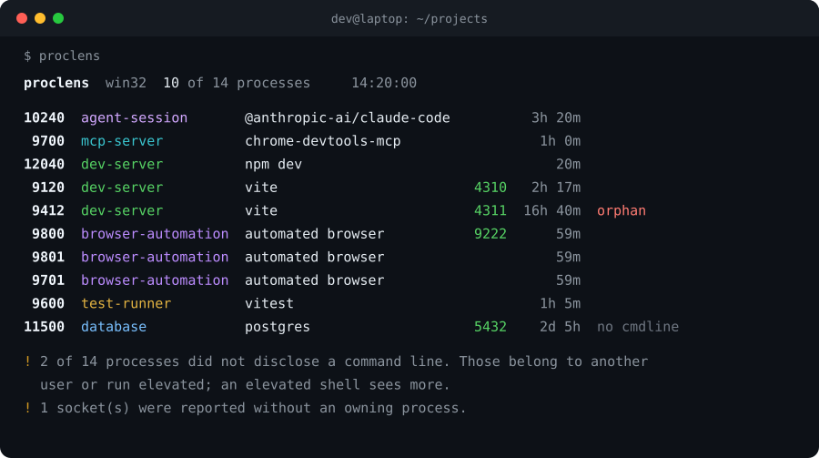

# proclens

<p align="center">
  
</p>

<p align="center">
  <em>What is this process, and which port is it holding?</em>
</p>

---

One evening a page would not load. Port 4310 was taken, so my dev server refused to start. `lsof -i :4310` gave me a pid and nothing else. I killed it. The page still would not load, because I had killed the wrong node. There were six of them in the process table, all called `node`, all owned by me, and the list told me nothing about which was which.

The one I wanted was an orphaned vite from a branch I had switched away from an hour earlier. Its parent shell was long gone, so it just sat there holding the port. Two rows down were eight `chrome.exe` processes that a `chrome-devtools-mcp` run had spawned, indistinguishable from the browser I actually had open, and I nearly killed those too.

The information I needed was all there. The command line said `vite`. The working directory said which project. The start time and the missing parent said orphan. The operating system just does not put those next to the pid. proclens does.

## What it does

proclens reads the process table and the socket table, then joins them and reads what is actually in each command line, so a screen full of `node` and `python` becomes:

- **a role**, inferred from the command line: agent session, MCP server, dev server, test runner, browser automation, database, watcher, language server, and a dozen more
- **the ports** each process is holding, listening ones first
- **the working directory** and the project it belongs to, so two `vite` processes are told apart by where they run
- **an orphan flag**, because the process holding your port is usually the one whose parent already exited
- **the evidence**, under `--explain`, so every role names the rule that produced it

Then it will kill by port or pid, after showing you exactly what it resolved and asking.

## Install

```bash
npm install -g proclens
# or run it once, no install
npx proclens
```

Zero runtime dependencies. `npx proclens` is one download with no supply chain to audit.

## Use it

```bash
proclens                    # developer-relevant processes, grouped by role
proclens vite               # anything matching "vite" in cmd, cwd, project or name
proclens --all              # every process, not just the interesting ones
proclens -r dev-server      # filter by role (repeatable, comma separated)
proclens -l                 # only processes holding a listening socket
proclens -o                 # only orphans
```

Answer the port question directly:

```bash
$ proclens port 4310
 9120  dev-server vite
   name      node.exe
   started   2026-08-14T09:02:11.450Z  (2h 17m ago)
   parent    6104
   cwd       C:\Users\dev\projects\shop-web  [shop-web]
   ports     tcp/::4310 listen
   why       known dev server in the command line (vite)
   cmd
       "node" "...\shop-web\node_modules\vite\bin\vite.js" dev --port 4310
```

Kill the holder of a port, after a confirmation that shows what you are about to end:

```bash
proclens kill --port 4310
proclens kill --pid 9412 --signal kill
proclens kill --port 4310 --yes      # skip the prompt in a script
```

See why each row was classified, and what the platform refused to tell proclens:

```bash
proclens --explain
```

Machine readable, for a script that decides what to do with the result:

```bash
proclens --json | jq '.processes[] | select(.orphan.value == true) | .pid'
```

### Options

```
-a, --all             every process, not just the developer relevant ones
-f, --filter <text>   substring of the command line, directory, project or name
-r, --role <role>     filter by role, repeatable or comma separated
    --pid <number>    filter by pid, repeatable
    --port <number>   filter by port, repeatable
-l, --listening       only processes holding a listening socket
-o, --orphans         only processes whose parent is gone
-s, --sort <key>      role | pid | age | port | name   (default: role)
    --compact         one line per process
-w, --wide            wrap the full command line instead of truncating it
-x, --explain         show the rule behind each role, and the platform limits
    --json            machine readable snapshot
    --no-color        disable ANSI colour (NO_COLOR is honoured too)
    --signal <name>   term | kill | int      (default: term)
-y, --yes             skip the kill confirmation prompt
```

## It tells you what it cannot see

Every process attribute an operating system can refuse to disclose is wrapped so proclens can say *unavailable, and here is why* instead of printing a confident guess. `--explain` prints the honest capability matrix for the platform you are on.

| | command line | working directory | ports | user |
|---|---|---|---|---|
| **Linux** | full, from `/proc/<pid>/cmdline` | your own always, others need root | full, `ss` or `/proc/net` joined by socket inode | full |
| **macOS** | full, from `ps` | your own via `lsof`, others need root | full, from `lsof` | full |
| **Windows** | partial, elevated processes withhold it | inferred from the command line only | full, `Get-NetTCPConnection` | none |

The Windows working directory is the sharp edge. Windows does not expose another process's cwd through any documented API short of walking its PEB with `ReadProcessMemory`, which needs matching bitness and debug rights and breaks on protected processes. proclens does not pretend. It infers a project directory from an absolute path in the command line and labels it `(inferred)`, or it says the value is unavailable. It never invents one.

The same honesty covers ports without an owner (a socket in `TIME_WAIT` after its process exited), command lines withheld by another user's elevated process, and start times on a kernel where `/proc/stat` was unreadable. A missing helper binary such as `ss` or `lsof` is a warning in the report, never a crash.

## How the roles are decided

A process table tells you `node` and stops. Everything useful lives in the command line, so that is where the rules look. `npm run dev` driving vite, a `--user-data-dir` that points at an automation profile rather than your everyday browser, `@modelcontextprotocol` in the arguments, `--remote-debugging-port` on a Chrome child: each is a rule, and each rule carries the sentence it prints as evidence. A classification you cannot check is a guess with better manners, so `--explain` shows you the one that fired.

Commands hidden inside a shell are unwrapped first. On Windows almost everything spawned from a script shows up as `cmd.exe` with the real command buried in caret escapes, so without unwrapping, half of a developer machine classifies as "cmd". proclens undoes the quoting the way `CommandLineToArgvW` does, then classifies the command that actually runs.

## As a library

The same snapshot the CLI renders is available programmatically, so a script can decide what to do with the processes it finds.

```ts
import { inspect } from 'proclens';

const snapshot = await inspect();
const orphanServers = snapshot.processes.filter(
  (p) => p.classification.role === 'dev-server' && p.orphan.value === true,
);

for (const p of orphanServers) {
  console.log(p.pid, p.classification.label, p.ports.map((port) => port.port));
}
```

`classify`, `filterProcesses`, `parseCommand`, `killProcesses` and the platform collectors are exported individually as well, and the collectors are pure over their captured output, so you can feed them a recording instead of a live machine.

## Development

```bash
npm install
npm run typecheck     # tsc --noEmit, strict
npm test              # vitest
npm run build         # emit dist/
```

The parsers are tested against captured fixtures of real `ss`, `lsof`, `/proc` and PowerShell output under `test/fixtures`, so platform behaviour is exercised on every machine rather than only on the one that produced it.

## License

MIT. Copyright (c) 2026 Dmitry Semenkevich.
