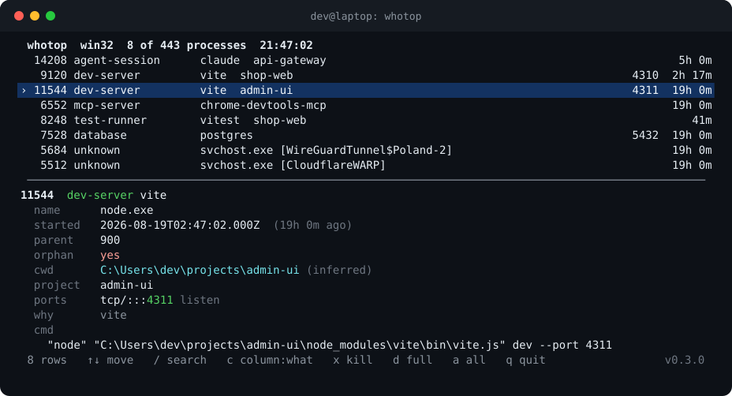

# whotop

<p align="center">
  
</p>

<p align="center">
  <em>What is this process, and which port is it holding?</em>
</p>

---

One evening a page would not load. Port 4310 was taken, so my dev server refused to start. `lsof -i :4310` gave me a pid and nothing else. I killed it. The page still would not load, because I had killed the wrong node. There were six of them in the process table, all called `node`, all owned by me, and the list told me nothing about which was which.

The one I wanted was an orphaned vite from a branch I had switched away from an hour earlier. Its parent shell was long gone, so it just sat there holding the port. Two rows down were eight `chrome.exe` processes that a `chrome-devtools-mcp` run had spawned, indistinguishable from the browser I actually had open, and I nearly killed those too.

The information I needed was all there. The command line said `vite`. The working directory said which project. The start time and the missing parent said orphan. The operating system just does not put those next to the pid. whotop does.

## What it does

whotop reads the process table and the socket table, then joins them and reads what is actually in each command line, so a screen full of `node` and `python` becomes:

- **a role**, inferred from the command line: agent session, MCP server, dev server, test runner, browser automation, database, watcher, language server, and a dozen more
- **the ports** each process is holding, listening ones first
- **the working directory** and the project it belongs to, so two `vite` processes are told apart by where they run
- **an orphan flag**, because the process holding your port is usually the one whose parent already exited
- **the name the system itself uses**, from the service registry, which needs no elevation and names processes that disclose nothing else
- **the project a silent process is working on**, read off the dated directory it wrote at startup, which is how five identical `claude.exe --resume` rows stop being identical
- **the evidence**, under `--explain`, so every role names the rule that produced it

That last one earns its place. On a Windows machine with 443 processes, 164 disclosed no command line at all. The service registry named 115 of them, a WireGuard tunnel and CloudflareWARP among them, all of which had been reading as `unknown`. Linux answers the same question from `/proc/<pid>/cgroup`, which also says when a process is inside a container.

Then it will kill by port or pid, after showing you exactly what it resolved and asking.

## Install

```bash
npm install -g whotop
# or run it once, no install
npx whotop
```

Zero runtime dependencies. `npx whotop` is one download with no supply chain to audit.

## Use it

Typed on its own, `whotop` opens an interactive screen. Everything else is a one-shot listing:

```bash
whotop                    # the interactive screen
whotop ls                 # developer-relevant processes, grouped by role
whotop ls vite            # anything matching "vite" in cmd, cwd, project or name
whotop ls --all           # every process, not just the interesting ones
whotop ls -r dev-server   # filter by role (repeatable, comma separated)
whotop ls -l              # only processes holding a listening socket
whotop ls -o              # only orphans
```

A pipe always gets the listing, so `whotop | grep vite` keeps working.

### The interactive screen

```
↑ ↓  or  j k     move            /     search, esc clears
PgUp PgDn        page            c     switch the middle column
g  G             first, last     x     kill the selected process
d                full view       a     show every process
esc              ask to quit     q     quit
```

The middle column cycles between what a process is, where it runs, and the command it ran, because one list cannot answer every question at once. The pane under it follows the cursor with no keypress, and is a fixed twelve lines: sized to its contents it grew on a long command line and pushed the list off the screen, so when it has to cut it says how many lines are hidden and `d` opens them. Fixed against its contents, not against the screen — on a short terminal it gives lines back to the list rather than push the footer off the bottom, and under three lines it steps aside entirely.

The cursor follows a **pid**, never a row number. The list reorders whenever a process exits, and a cursor anchored to a row would quietly settle on a different process than the one you were reading. Killing that one is the mistake this tool exists to prevent.

The screen takes a moment to open, because the first thing it does is ask the machine one question and wait for the whole answer. On Windows that is a single PowerShell round trip for the process table, the socket table and the service names together, and it costs a little over two seconds on a 300 process machine. Splitting it into three faster queries would be worse, not better: a port that moved between two of them would be reported against the wrong process, which is the one mistake this tool must not make.

So the wait is spent rather than hidden. A splash holds the screen, names the command it is waiting on, counts the seconds, and shows the keys so the wait teaches you something. Past six seconds it says the wait is unusual, and past fifteen it says how to get out — and means it, because raw mode turns ctrl-c into a byte that the splash reads itself. Anything else you type while it loads is kept and applied once the list arrives, so a `/` typed early still opens the search. Later refreshes are quieter: a `↻` next to the timestamp, drawn before the wait rather than after it.

Answer the port question directly:

```bash
$ whotop port 4310
 9120  dev-server vite
   name      node.exe
   started   2026-08-14T09:02:11.450Z  (2h 17m ago)
   parent    6104
   cwd       C:\Users\dev\projects\shop-web  [shop-web]
   ports     tcp/::4310 listen
   why       known dev server in the command line (vite)
   cmd
       "node" "...\shop-web\node_modules\vite\bin\vite.js" dev --port 4310
```

Kill the holder of a port, after a confirmation that shows what you are about to end:

```bash
whotop kill --port 4310
whotop kill --pid 9412 --signal kill
whotop kill --port 4310 --yes      # skip the prompt in a script
```

See why each row was classified, and what the platform refused to tell whotop:

```bash
whotop --explain
```

Machine readable, for a script that decides what to do with the result:

```bash
whotop --json | jq '.processes[] | select(.orphan.value == true) | .pid'
```

### Options

```
-a, --all             every process, not just the developer relevant ones
-f, --filter <text>   substring of the command line, directory, project or name
-r, --role <role>     filter by role, repeatable or comma separated
    --pid <number>    filter by pid, repeatable
    --port <number>   filter by port, repeatable
-l, --listening       only processes holding a listening socket
-o, --orphans         only processes whose parent is gone
-s, --sort <key>      role | pid | age | port | name   (default: role)
    --compact         one line per process
-w, --wide            wrap the full command line instead of truncating it
-x, --explain         show the rule behind each role, and the platform limits
    --json            machine readable snapshot
    --no-color        disable ANSI colour (NO_COLOR is honoured too)
    --signal <name>   term | kill | int      (default: term)
-y, --yes             skip the kill confirmation prompt
```

## It tells you what it cannot see

Every process attribute an operating system can refuse to disclose is wrapped so whotop can say *unavailable, and here is why* instead of printing a confident guess. `--explain` prints the honest capability matrix for the platform you are on.

| | command line | working directory | ports | user |
|---|---|---|---|---|
| **Linux** | full, from `/proc/<pid>/cmdline` | your own always, others need root | full, `ss` or `/proc/net` joined by socket inode | full |
| **macOS** | full, from `ps` | your own via `lsof`, others need root | full, from `lsof` | full |
| **Windows** | partial, elevated processes withhold it | inferred from the command line, or from a dated directory the process left | full, `Get-NetTCPConnection` | none |

The Windows working directory is the sharp edge. Windows does not expose another process's cwd through any documented API short of walking its PEB with `ReadProcessMemory`, which needs matching bitness and debug rights and breaks on protected processes. whotop does not pretend. It infers a project directory from an absolute path in the command line and labels it `(inferred)`, or it says the value is unavailable. It never invents one.

One case is worth naming, because the honest-looking answer was the wrong one. `C:\Users\me\.local\bin\claude.exe --resume` contains exactly one absolute path: its own. Reporting that directory made five agent sessions look as though they all worked inside their install folder. Nothing there was false, the field said `inferred`, and it was still useless. The directory a program lives in is not the directory it runs in, so that candidate is rejected. The answer for those rows comes from somewhere else, below.

The same honesty covers ports without an owner (a socket in `TIME_WAIT` after its process exited), command lines withheld by another user's elevated process, and start times on a kernel where `/proc/stat` was unreadable. A missing helper binary such as `ss` or `lsof` is a warning in the report, never a crash.

## How the roles are decided

A process table tells you `node` and stops. Everything useful lives in the command line, so that is where the rules look. `npm run dev` driving vite, a `--user-data-dir` that points at an automation profile rather than your everyday browser, `@modelcontextprotocol` in the arguments, `--remote-debugging-port` on a Chrome child: each is a rule, and each rule carries the sentence it prints as evidence. A classification you cannot check is a guess with better manners, so `--explain` shows you the one that fired.

Commands hidden inside a shell are unwrapped first. On Windows almost everything spawned from a script shows up as `cmd.exe` with the real command buried in caret escapes, so without unwrapping, half of a developer machine classifies as "cmd". whotop undoes the quoting the way `CommandLineToArgvW` does, then classifies the command that actually runs.

## Naming a process by what it leaves on disk

A process whose command line says nothing about its work often writes a directory that does. Claude Code creates `<temp>/claude/<encoded project path>/<session id>/` in the first seconds of a session, so a process that started at 18:48:22 and a directory created at 18:48:21 are the same session. That is the whole mechanism, and it is a time correlation, not a reading of the process.

```
15044  agent-session  claude         1d 15h
       cwd D:\work\ds\social-media (inferred)  [social-media]
       cmd C:\Users\37529\.local\bin\claude.exe --resume
       via matched to D:\Temp\claude\D--work-ds-social-media\85fa958f-..., created 1.9s from this
           process start (Claude Code session 85fa958f); a time correlation inside a 45.0s window,
           not a reading of the process
```

The sources are a table rather than code, because the idea is older than any one tool: where to look, how to read the names found there, how to turn a name into a project path. A new tool is a row plus a fixture. Only sources that were watched working on a real machine are in the table, since a rule reasoned out in the abstract would produce confident rows out of nothing.

Two thresholds decide, both heuristics and both named constants in `src/traces.ts`:

- **45 seconds** between the process start and the directory creation. Checked against six concurrent sessions on one machine: every one matched its own directory within 2.6 seconds, and the nearest directory belonging to a different project was 36.8 seconds away.
- **2 seconds** between the best candidate and the next one. Inside that gap the timestamps cannot separate them, so if the two name different projects the row reports **nothing** and says why. Naming the wrong project confidently is the worse failure here: there is a kill key next to that row.

What it will not do:

- it never returns `exact`, only `inferred` with the directory and the time difference in the note, or `unavailable` with the reason
- it never overwrites a directory the operating system actually disclosed
- a directory name is a lossy encoding, since every punctuation character became a dash, so `dimhold.by` and `dimhold-by` are the same name. whotop decodes it by walking the disk and asking which real directory encodes to that name, and reports nothing when the answer is not unique or when the project has been renamed or deleted since
- a session started before its trace directory was cleaned away, or on a machine where `TEMP` moved between runs, simply has no match, and the row says so
- it only reads the disk when the process table actually contains a process some rule speaks for, so the common listing costs nothing

## As a library

The same snapshot the CLI renders is available programmatically, so a script can decide what to do with the processes it finds.

```ts
import { inspect } from 'whotop';

const snapshot = await inspect();
const orphanServers = snapshot.processes.filter(
  (p) => p.classification.role === 'dev-server' && p.orphan.value === true,
);

for (const p of orphanServers) {
  console.log(p.pid, p.classification.label, p.ports.map((port) => port.port));
}
```

`classify`, `filterProcesses`, `parseCommand`, `killProcesses` and the platform collectors are exported individually as well, and the collectors are pure over their captured output, so you can feed them a recording instead of a live machine.

## Development

```bash
npm install
npm run typecheck     # tsc --noEmit, strict
npm test              # vitest
npm run build         # emit dist/
```

The parsers are tested against captured fixtures of real `ss`, `lsof`, `/proc` and PowerShell output under `test/fixtures`, so platform behaviour is exercised on every machine rather than only on the one that produced it.

## License

MIT. Copyright (c) 2026 Dmitriy Semenkevich.
